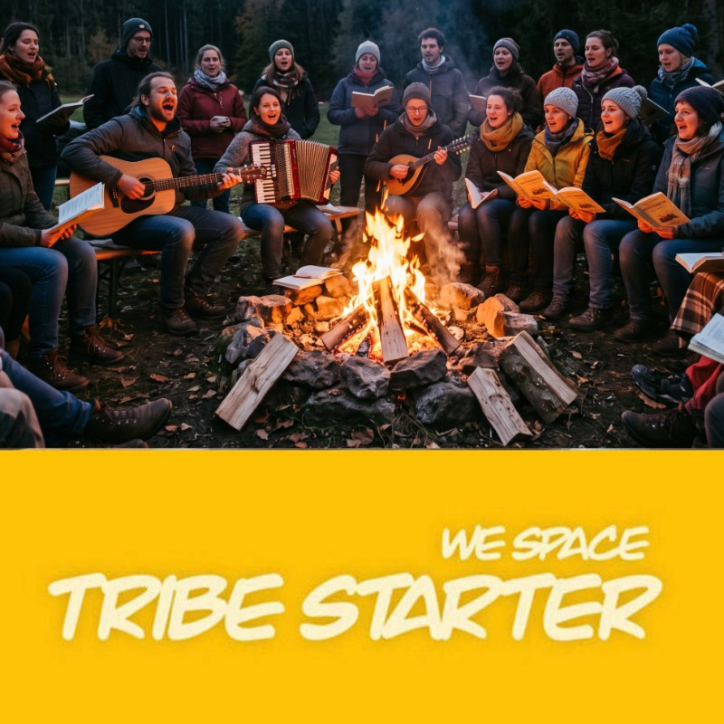

# 🎶 Singkreis & Lagerfeuer App – Tribe Starter (We-Space)

Ein moderner, interaktiver **digitaler Notenständer & Songbook** für Singkreise, Lagerfeuer-Abende, Chöre, Hauskreise und We-Space-Gruppen.

Mit über **120 beliebten Pop-, Rock- & Lagerfeuer-Klassikern**, **673 Mantren & heilsamen Liedern**, integrierter **Google Gemini AI** für automatisches Generieren neuer Songs und **Echtzeit-Synchronisation via Google Firebase Firestore**.

---

<p align="center">
  
  <br><br>
  <a href="https://www.tribestarter.org" target="_blank">
    <strong>🌐 www.tribestarter.org</strong>
  </a>
</p>

---

## 📱 Direkt ausprobieren & Mitsingen

Scanne den QR-Code mit deinem Smartphone, um die Singkreis-App sofort im mobilen Browser zu öffnen:

<p align="center">
  
  <br>
  <em>(Öffnet die Web-App direkt auf deinem Smartphone)</em>
</p>

---

## ✨ Features im Überblick

### 🎸 Digitaler Bühnen-Notenständer (Stage Mode)
* **100% Platz für Musik:** Schwarze Titelleiste und gelbe Werkzeugleiste scrollen nach oben aus dem Bild, sodass der gesamte Bildschirm für Text & Akkorde genutzt wird.
* **Pinch-to-Zoom (2-Finger-Geste):** Verändere die Textgröße stufenlos & intuitiv mit zwei Fingern direkt auf dem Touchscreen (oder via `Strg + Mausrad` am Desktop).
* **Erweiterter Textgrößen-Bereich (10px bis 76px):** Um 100% nach unten und oben erweitert – perfekt für riesige Bühnen-Displays oder kompakte Übersichten.
* **Echtzeit-Transponieren (Ton +/-):** Ändere die Tonart mit einem Klick in Halbtonschritten. Alle Akkorde passen sich sofort mathematisch präzise an.
* **Intelligenter Auto-Scroll mit Gestensteuerung:** Fließendes, freihändiges Mitlesen beim Musizieren. Starte oder stoppe das Scrollen blitzschnell mit **Double-Tap / Doppelklick** auf den Songtext.
* **Dezentes Tempo-Widget (80% transparent):** Frei wählbares Tempo von `0.2x` bis zu maximal `10.0x`. Das Widget dimmt sich nach 2 Sekunden automatisch auf 80% Transparenz herunter.
* **Akkorde Ein/Aus:** Für reine Mitsänger können Akkorde ausgeblendet werden, um den Liedtext kompakt anzuzeigen.
* **Akkord-Diagramme / Badges:** Übersicht aller im Song verwendeten Griffe am Ende jedes Liedes.
* **Dark / Light Mode & Druckansicht:** Kontrastreicher Bühnen-Dunkelmodus und saubere Druckansicht (`Ctrl+P`).
* **Original-Audio:** Direkter Button zum Anhören der Originalversion auf YouTube.

### 🕉️ Mantren & Heilsame Lieder (673 Songs)
* Vollständige Sammlung von 673 Chants, Herzensliedern & Mantren (Deva Premal, Krishna Das, May There Always Be Angels, u.v.m.).
* Schnelle Volltextsuche und Zufalls-Button (`🔀 Zufällig`).
* Ein Klick auf ein Mantra füllt sofort die AI-Suche aus, um Text & Gitarrenakkorde zu generieren.
* *Hinweis zum reflektierten Umgang:* Das rhythmische Wiederholen von Mantren und Texten wirkt über kognitive und suggestive Mechanismen direkt auf das Unterbewusstsein. Bei regelmäßiger und intensiver Anwendung können sich sprachliche Muster, Glaubenssätze und emotionale Zustände tief im Denken verankern. Achte daher auf einen eigenverantwortlichen und reflektierten Umgang.

### 🤖 AI Song-Finder & Generator (Google Gemini)
* **2-Schritt-Suche:** Recherchiert zuerst den passenden Titel, Interpreten und Erscheinungsjahr – erst bei Bestätigung werden vollständige Strophen, Refrains und präzise Gitarren-Akkorde generiert.
* **Live-Fortschrittsbalken:** Auffällige Leucht-Animation mit Live-Statusanzeige während der Generierung.
* **Alternative 10-Song-Recherche:** Falls der erste Treffer nicht passt, können auf Knopfdruck 10 passende Lieder recherchiert und einzeln generiert werden.

### 🌐 Cloud-Echtzeit-Synchronisation (Firebase Firestore)
* Erstellte Community-Songs werden **in derselben Sekunde** live auf die Geräte aller anderen Mitsänger im Kreis synchronisiert.
* Automatische Offline-Pufferung via `localStorage`.

---

## 🛠️ Selbst hosten (Self-Hosting)

Die App besteht aus einer **einzigen, hochoptimierten HTML/CSS/JS-Datei** (`index.html`) ohne komplexe Node-Build-Pipelines. Du kannst sie auf jedem statischen Webserver hosten:

### Option A: GitHub Pages (Kostenlos & Schnell)
1. Forke oder klone dieses Repository:
   ```bash
   git clone https://github.com/enzocage/singkreis-tribe-starter-we-space.git
   ```
2. Gehe in deinem GitHub-Repository auf **Settings** → **Pages**.
3. Wähle als Source `Deploy from a branch`, Branch `main` und Ordner `/(root)`.
4. Klicke auf **Save**. Deine App ist unter `https://<dein-username>.github.io/<repo-name>` erreichbar!

### Option B: Lokaler Webserver
```bash
# Mit Node.js npx serve:
npx serve .

# Oder mit Python 3:
python -m http.server 8080
```

---

## 📡 Eigene Firebase-Datenbank einrichten (Cloud-Sync)

Um deine eigene, private Echtzeit-Synchronisation für deinen Singkreis aufzubauen:

### 1. Firebase-Projekt erstellen
1. Gehe zur [Google Firebase Console](https://console.firebase.google.com/) und melde dich mit deinem Google-Konto an.
2. Klicke auf **Projekt hinzufügen** und vergib einen Namen (z.B. `mein-singkreis`).
3. Google Analytics kannst du optional deaktivieren.

### 2. Cloud Firestore-Datenbank anlegen
1. Klicke im linken Menü auf **Firestore-Datenbank** → **Datenbank erstellen**.
2. Wähle einen Standort (z.B. `europe-west3` Frankfurt).
3. Wähle für den Einstieg den **Testmodus** oder setze unter dem Reiter **Regeln** folgende Sicherheitsregel:
   ```javascript
   rules_version = '2';
   service cloud.firestore {
     match /databases/{database}/documents {
       match /{document=**} {
         allow read, write: if true;
       }
     }
   }
   ```
4. Klicke auf **Veröffentlichen**.

### 3. Web-App registrieren & Zugangsdaten kopieren
1. Klicke auf das Zahnrad ⚙️ (Projekteinstellungen) → Tab **Allgemein**.
2. Scrolle nach unten zu *Meine Apps* und klicke auf das Web-Symbol `</>`.
3. Vergib einen Namen (z.B. `Singkreis Web App`) und klicke auf **App registrieren**.
4. Kopiere die `firebaseConfig`-Werte:
   * `apiKey`
   * `projectId`
   * `appId`
   * `authDomain` (optional)
   * `storageBucket` (optional)

### 4. Zugangsdaten in der App hinterlegen
Du kannst die Daten auf zwei Wegen hinterlegen:

* **Variante 1 (Direkt in der App):**  
  Öffne die App im Browser, klicke ganz oben auf `🌐 Cloud-Sync` und füge deine Zugangsdaten ein. Klicke auf **Verbindung jetzt testen** und **Speichern**.
* **Variante 2 (In der `.env`-Datei):**  
  Erstelle eine Datei `.env` im Projektordner:
  ```env
  FIREBASE_API_KEY=AIzaSy...
  FIREBASE_PROJECT_ID=mein-singkreis-123
  FIREBASE_APP_ID=1:123456789:web:abcdef...
  FIREBASE_AUTH_DOMAIN=mein-singkreis-123.firebaseapp.com
  ```

---

## 🔑 Google Gemini API-Key einrichten (Für AI-Song-Generierung)

Die AI-Funktion nutzt das kostenlose Modell **Gemini 2.5 Flash** von Google:

1. Hole dir in 10 Sekunden einen kostenlosen Key unter:  
   👉 **[https://aistudio.google.com/app/apikey](https://aistudio.google.com/app/apikey)**
2. Trage ihn entweder direkt in die Datei `.env` ein:
   ```env
   GEMINI_API_KEY=AIzaSy...
   ```
   oder gib ihn in der App im Modal `✨ Song hinzufügen` unter `🔑 API Key` ein (wird sicher im Browser gespeichert und nie im Klartext angezeigt).

---

## 📂 Projektstruktur

```
singkreis/
├── index.html                 # Vollständige Standalone-App (HTML, Tailwind CSS, JS)
├── mantras_data.json          # 673 heilsame Lieder & Mantren
├── singkreis.jpg              # Offizielles Tribe Starter Bild / Logo
├── qr.png                     # QR-Code zur mobilen App
├── .env                       # Lokale Konfiguration (API-Keys & Firebase)
├── build_songs_database.js    # Skript zur Generierung der 122 Standard-Songs
├── sync_mantras_to_firebase.js# Batch-Uploader für Mantren in Firestore
└── README.md                  # Dokumentation
```

---

## 🤝 Community & We-Space

Dieses Projekt wurde mit Liebe für Singkreise und Gruppen-Verbindungsräume entwickelt.

Besuche **[www.tribestarter.org](https://www.tribestarter.org)** für mehr Informationen über Gemeinschaftsaufbau, Singkreise und We-Space-Events.

---

## 📄 Lizenz

Dieses Projekt ist **Open Source** lizenziert unter der [MIT-Lizenz](LICENSE).  
Beiträge, Song-Vorschläge und Pull Requests sind herzlich willkommen!
